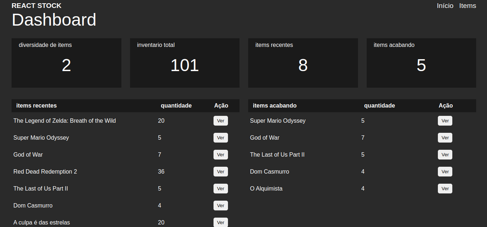
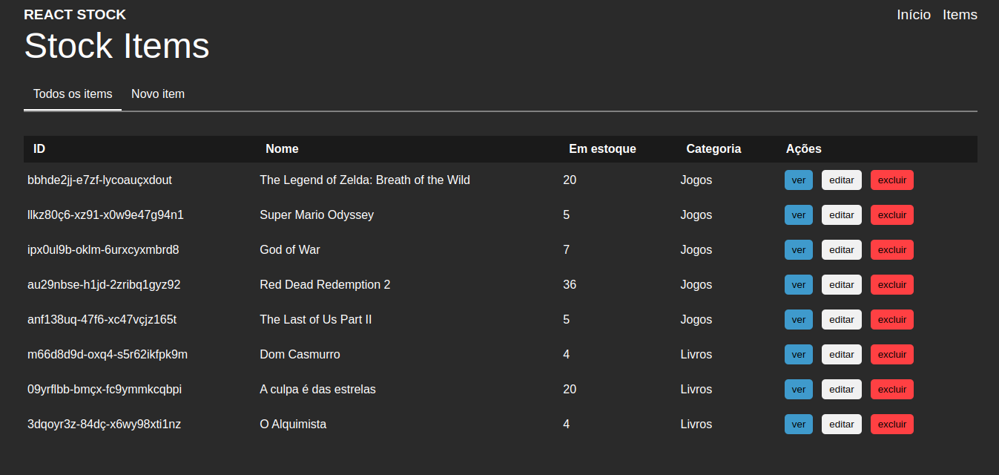
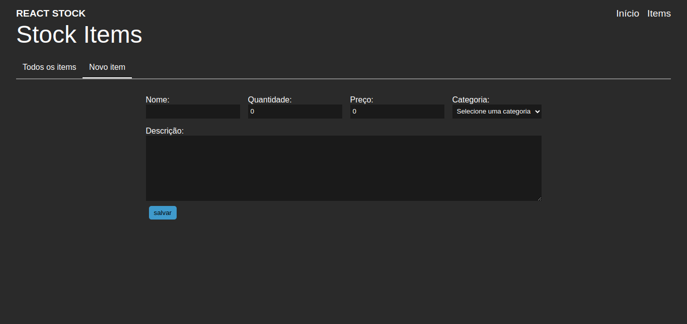

# Gestor de Estoque
Este é um exercício de React que consiste em um gestor de estoque. O aplicativo utiliza o React Router DOM para criar uma página dinâmica que permite adicionar, editar e apagar itens do estoque. Além disso, os dados são salvos no Local Storage para persistência.

## Funcionalidades
Adicionar um novo item ao estoque, informando o nome, quantidade e preço.
Editar um item existente no estoque, atualizando suas informações.
Apagar um item do estoque.
Visualizar a lista de itens do estoque.
## Tecnologias utilizadas
React, React Router DOM e 
Local Storage.
Para executar o projeto
Clone este repositório.
Navegue até o diretório do projeto no seu terminal.
Execute o comando npm install para instalar as dependências.
Execute o comando npm start para iniciar o servidor de desenvolvimento.

## imagens do projeto

